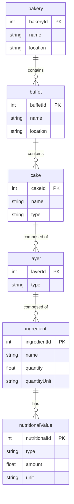

<!--

-->

# Bakery example

## ER diagram

```mermaid
erDiagram

    bakery ||--o{ buffet : contains
    buffet ||--o{ cake : contains
    cake ||--o{ layer : "composed of"
    layer ||--o{ ingredient : "composed of"
    ingredient ||--o{ nutritionalValue : has

    bakery {
        int bakeryId PK
        string name
        string location
    }

    buffet {
        int buffetId PK
        string name
        string location
    }

    cake {
        int cakeId PK
        string name
        string type
    }

    layer {
        int layerId PK
        string type
    }

    ingredient {
        int ingredientId PK
        string name
        float quantity
        string quantityUnit
    }

    nutritionalValue {
        int nutritionalId PK
        string type
        float amount
        string unit
    }

```
